# Preface

This guide assumes you do not know anything about web development, Docker and Git.

# Getting the Atomix sourcecode

## Step 1: Get a PAT

Follow the steps in the "Install Atomix" guide for how to get a PAT. You will need a PAT to install Atomix dependencies.

## Step 2: Install Git

We use the very popular [Git](https://git-scm.com/) to track revisions to our code.

You must install Git on your machine before you can get and contribute to Atomix.

Download and install Git for your platform [here](https://git-scm.com/download) (ensure it is 2.0 or greater).

## Step 3: Install a Git client

We recommend you install and use [VSCode](https://code.visualstudio.com/) to do all code changes and for using Git.

Click the "Source Control" button in the menu to access the Git section.

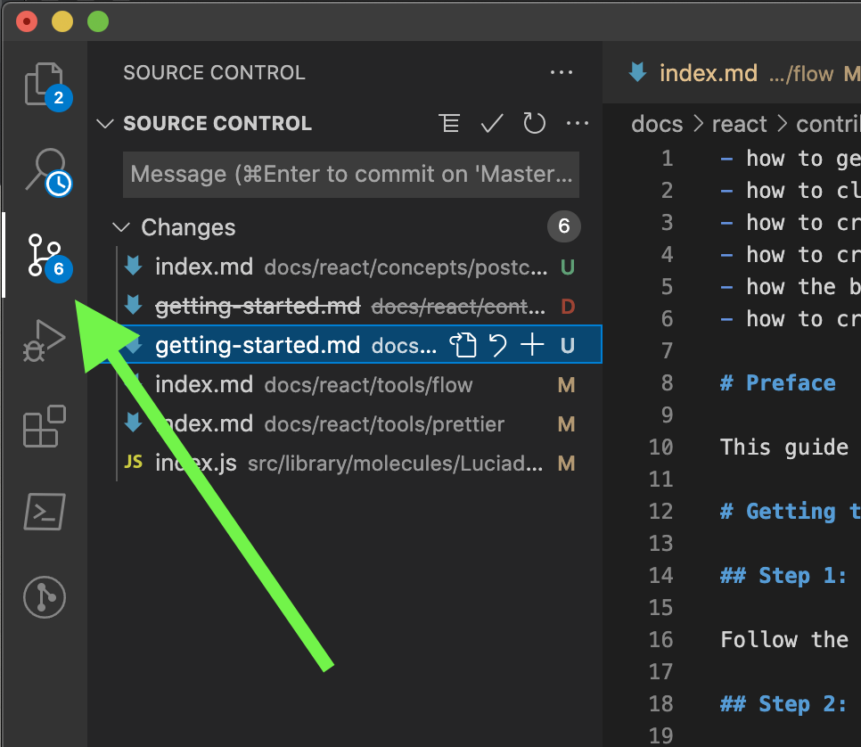

**Don't know how to use Git? Read our Git guide under Concepts.**

# Step 4: Clone repo

1. In your browser go to [the Git repo](https://dev.azure.com/HexagonMinAustralia/_git/Atomix).
2. Click the **Clone** button:
  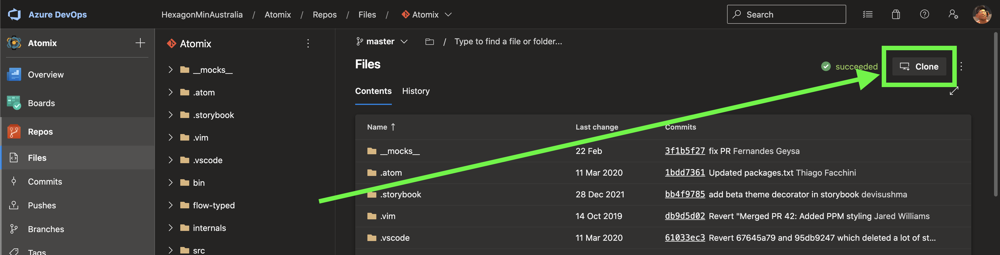
3. In the pop-up click **Generate credentials**:
  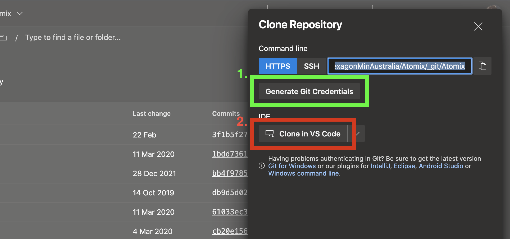
4. Copy the password.
5. Then click **Clone in VS Code**. It will open VSCode for you.
6. Select a location for Atomix. We recommend you create a directory called "Code" and select that.
  eg. `C:/Users/wij/Code` (the result will be `C:/Users/wij/Code/Atomix`)
7. When it asks for a password, paste the password you generated earlier.
8. When it is done it should pop-up asking you if you would like to open the repo. Click **Open**.
  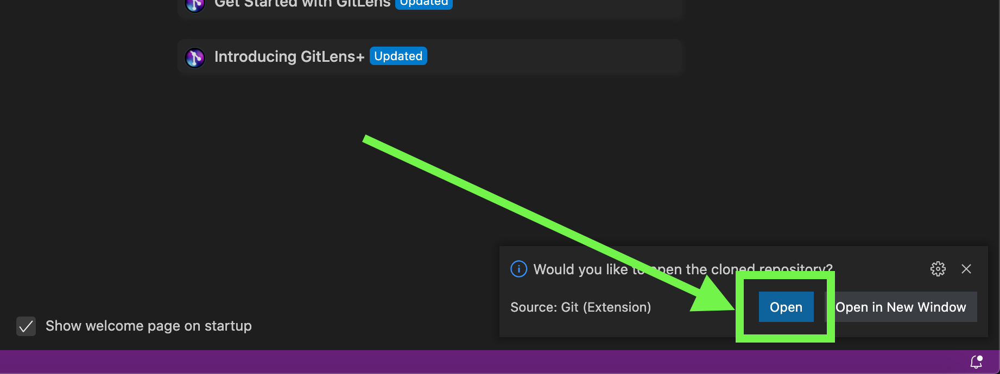

You should now have Atomix!

# Step 5: Install NPM dependencies

We need to install dependencies so that our VSCode extensions work properly.

**Note:** You can perform these steps outside of VSCode in your terminal if you like.

1. Inside VSCode click the **Terminal** menu bar item. Then click **New Terminal**. A panel should open:
  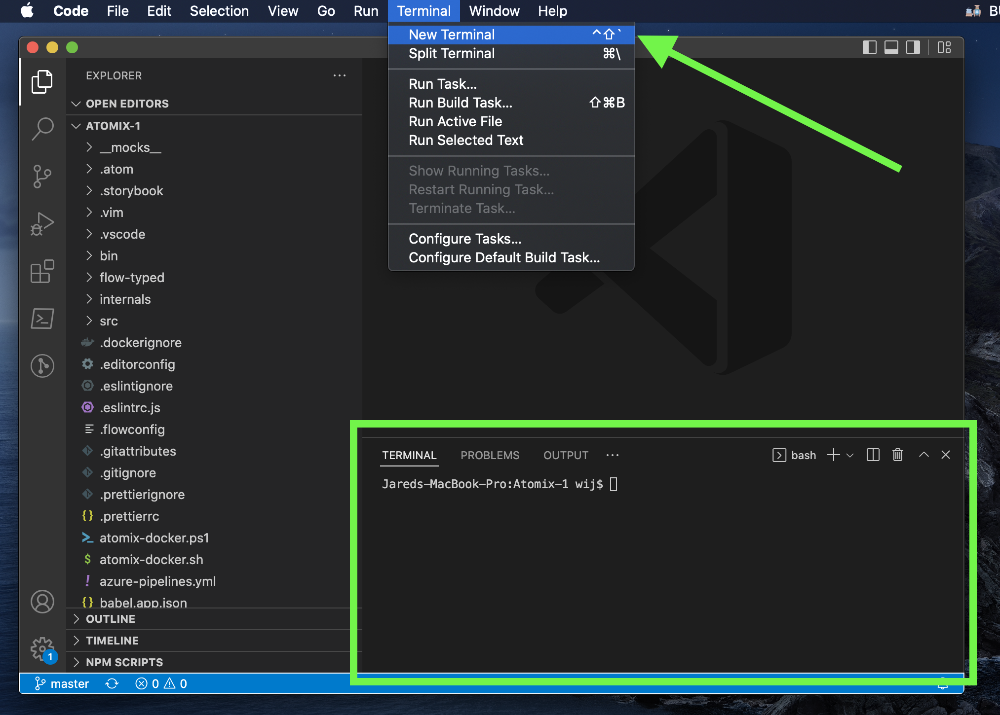
2. In the terminal type this command into it:
    
		npm i
3. Press the enter key. It should start installing:
  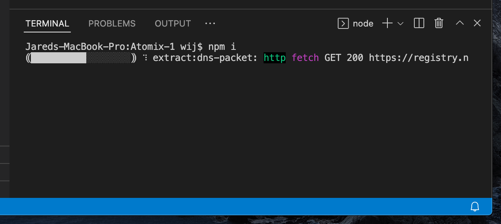

When it says "added 2527 packages from 1442 contributors" (with the numbers being approximate) it is successful!

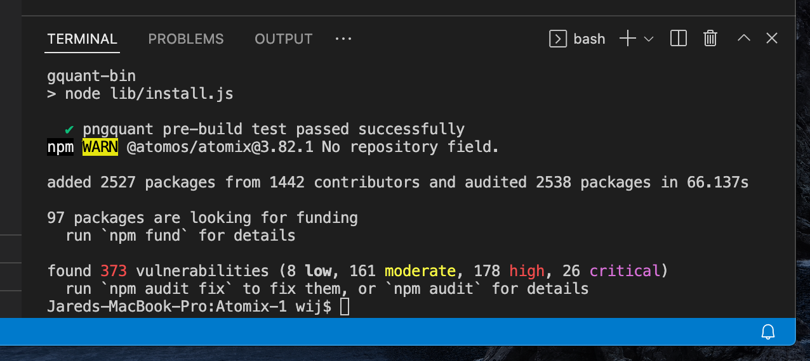

# Step 6: Install VSCode extensions

To code Atomix in VSCode, you need specific extensions.

**VSCode might prompt you that Atomix recommends you specific extensions. If it does, install them. Don't forget the Flow steps!**

Go to the Extensions area:

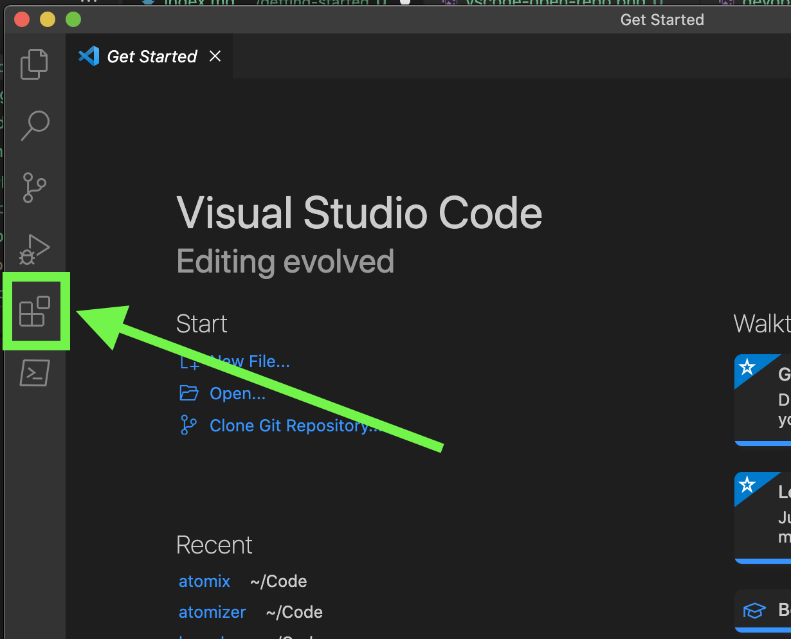

## Step 6.1: Install ESLint

Search for and install `dbaeumer.vscode-eslint`.

## Step 6.2: Install Prettier

Search for and install `esbenp.prettier-vscode`.

## Step 6.3: Install Flow

Search for and install `gcazaciuc.vscode-flow-ide`.

### Step 5.3.1: Configure Flow

1. Open your Settings for VSCode:
  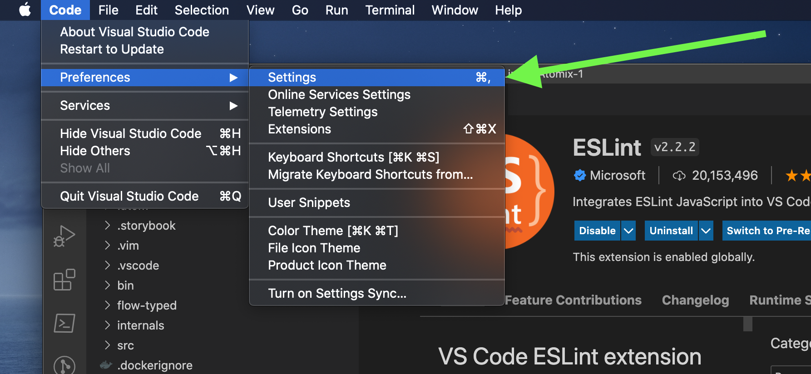
2. Search for "flowide"
3. For the "Path to Flow" change the value from a blank field to `node_modules/.bin/flow`

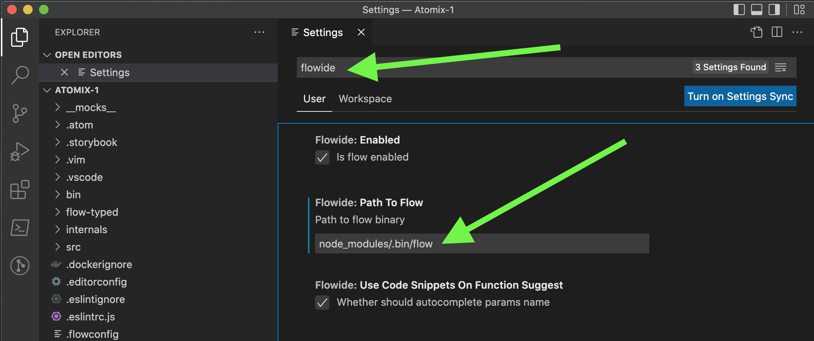

## Step 6.2: Restart VSCode

Restart just to ensure all extensions are working properly.

# Step 7: Install Docker

We use Docker to build and run Atomix locally. It means we have a consistent developer experience for everyone and allows us to build complex modules such as WebAssembly.

## Step 7.1: Download and install Docker

### Windows

Go [here](https://docs.docker.com/desktop/windows/install/) and download and install Docker for Windows.

### macOS

We recommend you use [Homebrew](https://brew.sh/).

1. Install Docker Desktop:

       brew install docker --cask

2. Install Ruby:

       brew install ruby

3. Install `docker-sync`:

       gem install docker-sync

### Verifying it installed

If it installed correctly, open a terminal and check the version:

    docker -v

Output:

    Docker version 20.10.5, build 55c4c88

# Step 8: Start Docker

Think of the Docker container as a virtual machine. It needs to be started when you want to work with Atomix and stopped when you don't need it.

We have created some scripts to help you start Docker:

## Step 8.1: Starting the container

### Windows

In the terminal (PowerShell) of VSCode run this command to start Docker:

    .\bin\atomix.ps1 start

### macOS and Linux

In the terminal (Bash) of VSCode run this command to start Docker:

    ./bin/atomix start

Note that the first time you run this will take a lot longer and will output more:

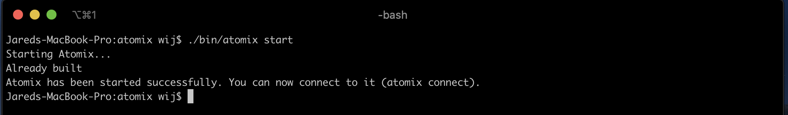

### Stopping Docker

If you need to stop it for whatever reason you can run the same command but replace "start" with "stop":

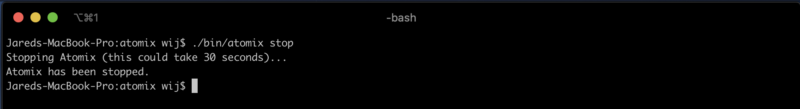

## Step 8.2: Giving the .npmrc file

The Docker container is completely independent of your own machine. It doesn't have a .npmrc file with your PAT. But it is easy to give it.

### Step 8.2.1: Copy

Copy your .npmrc file into the Atomix project directory.

## Step 8.3: Installing NPM dependencies

Just like we did locally, you also have to do it inside the Docker container:

### Windows

    .\bin\atomix.ps1 exec npm i

### macOS and Linux

    ./bin/atomix exec npm i

# Step 9: Start Atomix

Now that the Docker container is running you can start Atomix!

### Windows

    .\bin\atomix.ps1 exec npm start

### macOS and Linux

    ./bin/atomix exec npm start

# Done

When it is successful you can open your browser to this page:

http://localhost:8080

You should be able to make changes to the Atomix sourcecode, have it synced to the Docker container and it will refresh your browser!

# Next Steps

## How to create a new React component

[link to page]

## Getting a change into Atomix

Have you made all of the code changes you want to do? Let's get your changes into Atomix!

[Go to the next page]

# Troubleshooting

## Atomix

### When I make a change it does not refresh my browser

This shouldn't happen. Please contact us.

On Mac? You might need to force it to sync. Run `./bin/atomix resync` to restart `docker-sync`.

## Docker

### I can't get Docker to work

Ensure you have followed all of the steps correctly, tried Googling it for help and if all else fails, contact us.

## NPM

### Authentication or 401 error when installing NPM dependencies

Are you sure you have set up your encoded PAT and .npmrc correctly?  Verify your .npmrc file is in the correct place and has the encoded PAT set.

Your PAT could have expired. Try creating a new one.

If you are sure please contact us for more help.

## VSCode

### I can't find an extension!

There is a very low chance the extension might not be available. If you have searched for it and couldn't find it, contact us.
