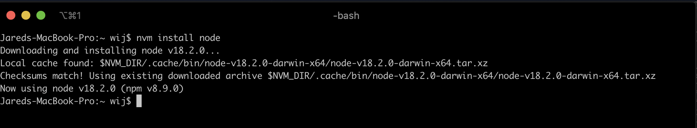
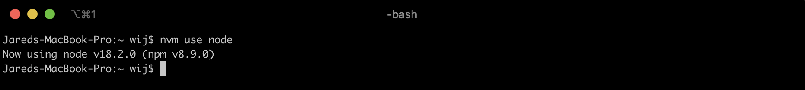
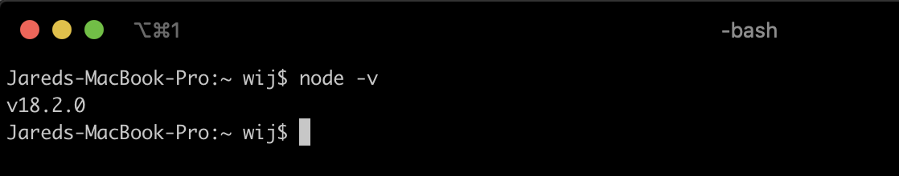
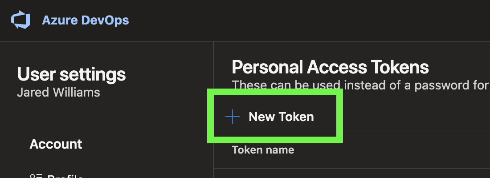
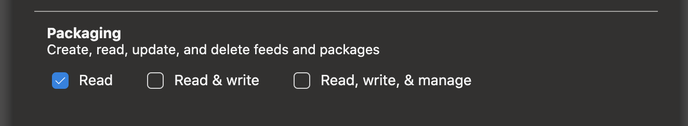
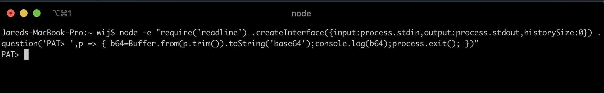
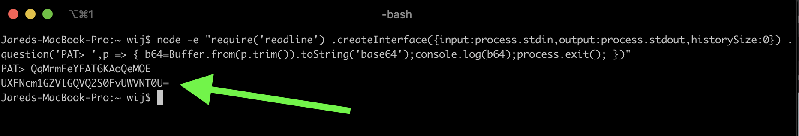
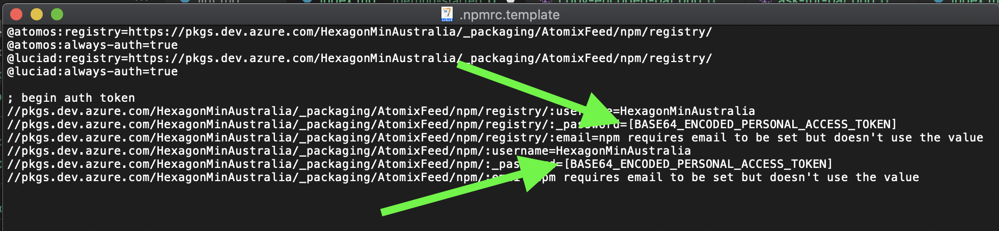
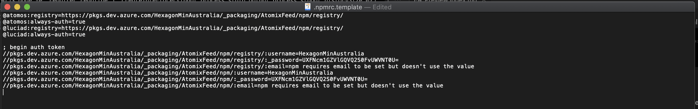
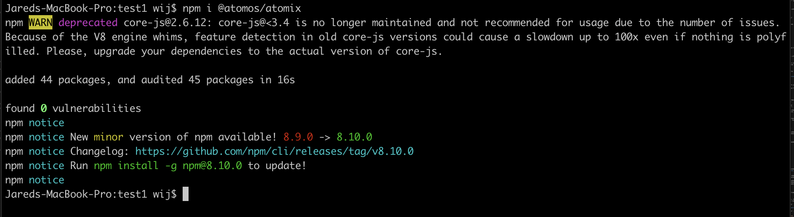

This guide will help you get started from scratch. It assumes you don't know anything about topics such as Node.js, NPM or Git.

# How Atomix is distributed

The React library for Atomix is distributed as an NPM package. This is simply a compressed archive (like a ZIP) that contains the code and any related assets like fonts and images.

# Step 1: Install Node.js

Node.js is a requirement for Atomix and web and desktop applications in general.

## Step 1.1: Install NVM

**Node Version Manager** is a tool that lets you switch versions of Node.js easily. It is not required (you can install Node.js manually) but we strongly recommend it.

### Windows

Download [nvm-windows](https://github.com/coreybutler/nvm-windows/releases/download/1.1.9/nvm-setup.exe) and install it.

### macOS and Linux

Run this command in your terminal:

    curl -o- https://raw.githubusercontent.com/nvm-sh/nvm/v0.39.1/install.sh | bash

Copied from the [README](https://github.com/nvm-sh/nvm).

## Step 1.2: Open your terminal

Installing Atomix requires you to type in commands into a terminal. Don't worry - we will explain what you need to type in!

### Windows

Open Start Menu and search for "powershell" and launch the first result.

### macOS

Open the Terminal app. It will be zsh (or Bash on older macOS versions).

### Linux

We will assume you know what you are doing!

## Step 1.3: Install Node.js

We will install the latest version of Node.js. Don't panic if it is different to the screenshots - Atomix should work on any version of Node.js.

In your terminal type the following commands to install Node.js:

    nvm install node

Then press the enter key. It will output something like:

    Downloading and installing node v18.2.0...
    Now using node v18.2.0 (npm 8.9.0)

Example:

Then type:

    nvm use node

And press the enter key again. It will output something like:

    Now using node v18.2.0 (npm v8.9.0)

Example:

Done!

## Step 1.4: Verify Node.js is installed

In your terminal type the following command to verify Node.js is installed properly:

    node -v

It should output something along the lines of

    v18.2.0 (npm 8.9.0)

Example:

It might show an even newer version. That's okay - if there are any issues we can switch you to an older version (just ask)!

# Step 2: Get a PAT

A Personal Access Token is a requirement for installing Atomix. Your PAT represents you and you alone.

**Never share your PAT with anyone. It represents you and we take security seriously.**

## Step 1.1: Request access

You must be manually added to Atomix before you can get a PAT.

Send an email to **atomix@hexagon.com** and fill in this template to be added:

TODO

## Step 1.2: Create a PAT

1. Go to [Personal access tokens](https://dev.azure.com/HexagonMinAustralia/_usersSettings/tokens)
2. Click **New Token**
   
3. Give it a meaningful name (eg. "Atomix") 
4. Enable **Read** under **Packaging**
	 
5. Copy the PAT to somewhere safe and secure

# Step 2: Create a .npmrc

A .npmrc file (yes there is a dot at the start) is how we authenticate with Atomix. It is a special, hidden file that is stored on your computer forever.

## Step 2.1: Use our template

We have a template for you to get started!

Download [this file](./assets/.npmrc.template). Place it into your **home directory** which will change depending on your operating system:

### Windows

Generally this is `C:/Users/your_name` depending on your computer. 

eg. `C:/Users/wij/.npmrc`

### macOS

`/Users/your_name`

eg. `/Users/wij/.npmrc`

### Linux

We assume you know where this is!

## Step 2.2: Encode your PAT

Your .npmrc can't authenticate yet - you aren't using your PAT. Before we add your PAT we must **encode it**. This can be done in your terminal.

1. Open PowerShell or zsh or Bash like we did before.
2. Copy this text and paste it into your terminal:

       node -e "require('readline') .createInterface({input:process.stdin,output:process.stdout,historySize:0}) .question('PAT> ',p => { b64=Buffer.from(p.trim()).toString('base64');console.log(b64);process.exit(); })"

	Then press the enter key.

3. It will ask you for your PAT. Copy it from earlier and paste it into your terminal:
	
	Then Press the enter key.
4. It will output a long jumble of letters, numbers and symbols. It should always end with at least one equals symbol (=). Copy the whole line of text (see green arrow):
  

    In this example my encoded PAT is:

        UXFNcm1GZVlGQVQ2S0FvUWVNT0U=

5. Copy the encoded PAT for the next step

## Step 2.3: Insert your PAT into your .npmrc

Now that you have an encoded PAT, open your `.npmrc` in a text editor like Notepad (or TextEdit).

Find where it says `[BASE64_ENCODED_PERSONAL_ACCESS_TOKEN]` and replace it with your encoded PAT. It should say it twice:

Your `.npmrc` file should look something like this:

Save the file and you are done!

# Step 3: Install Atomix

## Step 3.1: Restart your terminal

To use your new PAT we need to restart your terminal.

## Step 3.2: Create a new project directory

In your terminal (or using Windows Explorer or Finder) create a new directory anywhere you like. Remember the path to it.

eg. `C:/Users/wij/my-awesome-project`

## Step 3.3: Navigate into the directory

In your terminal navigate into the directory (this works in all terminals):

	cd "C:/path/to/your/project"

**Note:** Make sure you use quotation symbols because spaces can break the command.

## Step 3.4: Install Atomix

Run this command to install the latest version of Atomix into your new project:

    npm i @atomos/atomix

It should show a loading indicator. After approximately 30 seconds it should show a success message like below:

## Done!

You have Atomix!
