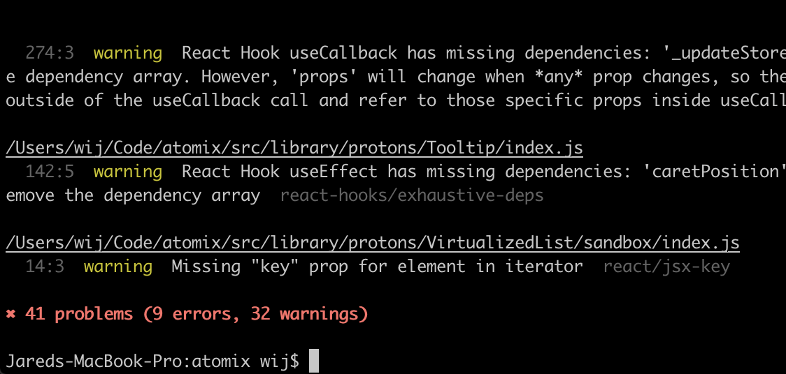
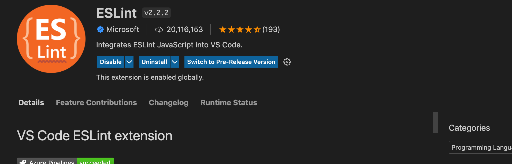

- what linting is
- why we do it
- how to run the NPM command
- how to set up with VSCode
- troubleshooting

# What is linting?

Linting is the automated checking of source code for programmatic and stylistic errors.

# Why do we lint?

It's important to to reduce errors and improve the overall quality of the source code, it also helps to accelerate development and reduce costs by finding errors earlier, not to mention that code convention is a key ingredient for multiple teams contribution.

# How does Atomix lint?

We use the hugely popular [ESLint](https://eslint.org/) to perform our linting.

The rules we enforce are listed in the `.eslintrc.js` file in the root of the project.

We also check linting in automated builds.

# How do I check linting?

You can either use the terminal or check it as you code in your IDE (like VSCode).

## Terminal

Simply run the `npm run lint` command to check the status of linting. The command will fail if there are any errors.



## VSCode

Install the `dbaeumer.vscode-eslint` VSCode extension (named "ESLint") by Microsoft. It should start linting immediately.



# Troubleshooting

## Conflicts with Prettier

There may be instances where Prettier will format some code that breaks the linter. In those cases disable Prettier:

```jsx
// prettier-ignore
const doSomething = 
	() => {
	}
```

## Linting passes locally but fails in the build

Verify you are running the command inside of the Docker container on the latest sourcecode. It may be necessary to restart the Docker container.

If all else fails please contact us to resolve it.
