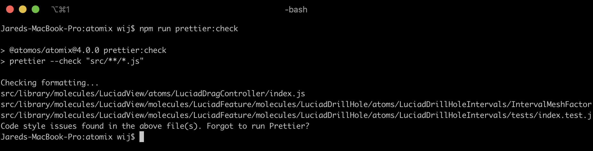
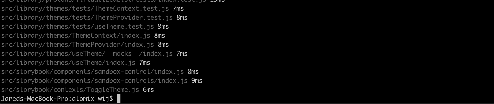
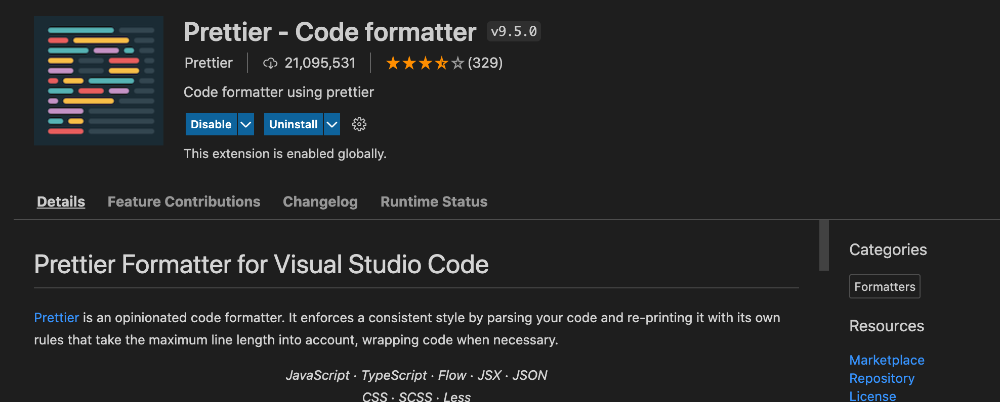
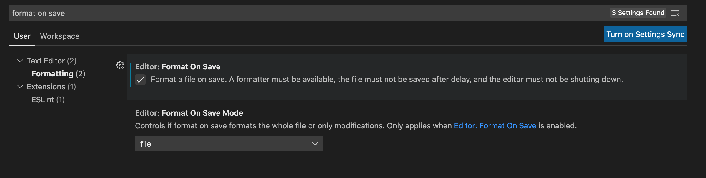

# What is Prettier?

Prettier is an opinionated code formatter.

It will **automatically format your code** so that it conforms to a ruleset for how code should be formatted in Atomix.

It ensures that all code is indented properly and removes semi-colons.

# Why do we use Prettier?

We don't want to waste time manually formatting our code with the proper indenting, brackets, semi-colons, etc. Prettier will do it for you.

It means you focus more on creating awesome React components and less on does my code look good.

# How do I use Prettier?

## Terminal

In your terminal you can either check the status of Prettier or apply (format) your code with Prettier.

### Check

It will fail if Prettier detects any non-formatted code:

    npm run prettier:check



### Format

It will **modify your code** so that it is correct. This is generally pretty safe to do (but make a backup if you are unsure):

    npm run prettier

It will output the path to *every* file it has changed:



## VSCode

You can make Prettier format your file whenever you save it (recommended).

Install the `esbenp.prettier-vscode` VSCode extension:



Then open your settings and search "format on save" and enable the setting:



Now whenever you save a file it will automatically run Prettier on it.

# Troubleshooting

## Conflicts with linting or Flow

There may be instances where Prettier will format some code that breaks the linter or Flow. In those cases disable Prettier:

```jsx
// prettier-ignore
const doSomething = 
	() => {
	}
```

## VSCode formats on saving EVERY file! Annoying!

You will have to modify your settings JSON to only enable formatting on save on JavaScript files:

```json
{
    "editor.formatOnSave": false,
    "[javascript]": {
        "editor.defaultFormatter": "esbenp.prettier-vscode",
        "editor.formatOnSave": true
    }
}
```
